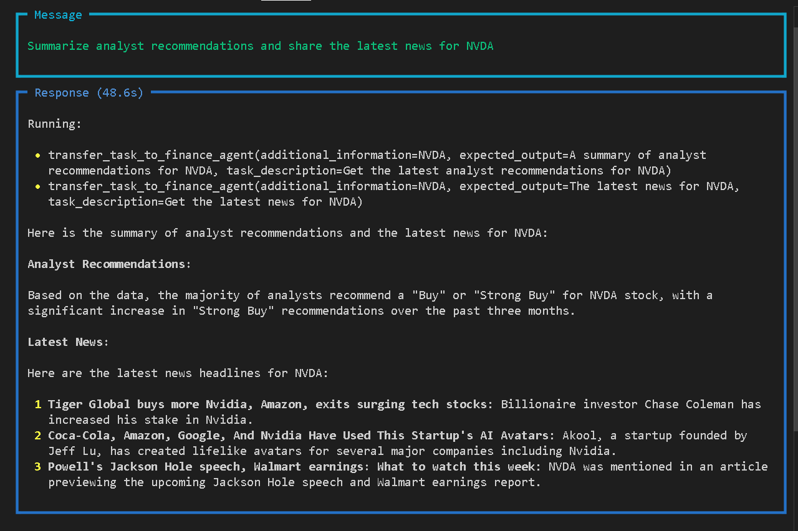

# Agentic AI with Groq and Phidata

This project demonstrates how to build agentic AI workflows using [Phidata](https://github.com/phidatahq/phidata) and [Groq](https://groq.com).  
It combines multiple specialized agents (Finance Agent and Web Search Agent) into a multi-agent system that can answer queries, fetch financial data, and summarize web information.

---

## Features

- Web Search Agent: Searches the web using DuckDuckGo and returns sources.  
- Finance Agent: Fetches stock price, fundamentals, analyst recommendations, and company news using Yahoo Finance.  
- Multi-Agent Orchestration: Routes tasks across agents with Groq’s LLaMA 3 model.  
- Playground UI: Interact with your agents using a FastAPI + Phidata Playground.  

---

## Project Structure

GenAi-Project/
│── financial_agent.py # Multi-agent orchestration example
│── playground.py # FastAPI playground entrypoint
│── requirements.txt # Python dependencies
│── .env # API keys (not committed)
│── .gitignore # Ignored files

python -m venv venv
source venv/bin/activate   # Mac/Linux
venv\Scripts\activate      # Windows

pip install -r requirements.txt

OPENAI_API_KEY=your_openai_key
GROQ_API_KEY=your_groq_key

python playground.py

Then open your browser at:
http://127.0.0.1:7777